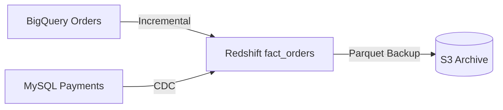

# Data Engineering Visual Pipeline AI Assistant

A flexible, AI-powered assistant for designing complex data pipelines, generating ETL architecture, and producing visual diagrams.

## 📘 Overview

This project is an AI-assisted framework that helps Data Engineers, Solution Architects, and Analytics Engineers design complete data pipelines through structured prompts.

The assistant can:

- Analyze technical requirements
- Break down business & optional requirements
- Support multi-source / multi-target pipelines
- Generate ETL design options
- Visually design pipelines using Mermaid diagrams
- Allow iterative discussions and refinements
- Let users freely add data nodes, ETL flows, and tools
- Output documentation-ready architecture drafts

This project is designed to be used with ChatGPT, Claude, or any compatible LLM.

## 📑 Table of Contents

- [Features](#-features)
- [Prompt Template](#-prompt-template)
- [How to Use](#-how-to-use)
- [Input Structure](#-input-structure)
- [Output Structure](#-output-structure)
- [Example Flow](#-example-flow)
- [Future Enhancements](#-future-enhancements)

## 🚀 Features

### 🧠 AI Analysis
- Requirement breakdown
- Identification of risks, assumptions, and missing info

### 🔄 Multi-source / Multi-target Design
- Add any number of data nodes
- Add multiple ETL flows
- Redesign nodes freely

### 🗺️ Visual Pipeline (Mermaid)
- Auto-generated pipeline architecture
- Supports iterative edits

### 🛠️ Practical Solutions
- Multiple solution options
- Pros & cons
- Implementation steps

### 📝 Documentation Ready
- Clean Markdown output
- Suitable for Confluence, GitHub, internal wikis

## 🔧 Prompt Template

Copy and paste the following into ChatGPT / Claude / OpenAI Playground.

```
You are a senior Data Architect and Data Engineer.  
Your job is to help design, evaluate, and refine data pipeline solutions using user inputs.  
You support multi-source and multi-target pipelines, and you allow iterative modifications.

------------------------------------------------------------
🎯 OUTPUT REQUIREMENTS

When I provide input, produce:

## 1. Requirements Breakdown
- Business requirements
- Technical requirements (mandatory)
- Optional product requirements
- Risks, assumptions, limitations
- Responsibilities (DBA vs Data Engineer)

## 2. Solution Options
Provide at least two end-to-end solutions:
- Architecture overview
- Pros & cons
- Complexity & performance notes
- Which requirements each solution satisfies

## 3. ETL / Pipeline Design
- Source → Transform → Target mapping
- Job orchestration suggestions
- Incremental logic / CDC patterns
- Table schema considerations
- Data quality / validation steps

## 4. Visual Diagram
Generate a Mermaid diagram showing:
- All data nodes
- All ETL paths
- Multi-source & multi-target routing
- Labels (Full Load / Incremental / CDC / Batch / Streaming)

The diagram must support later edits and refinements.

## 5. Clarifying Questions
List anything missing or ambiguous.

------------------------------------------------------------
🧩 INPUT FORMAT

#TechnicalRequirement
<mandatory requirements>

#OptionalProductRequirement
<optional or nice-to-have requirements>

#ExistingTools
<list of tools / databases / platforms>

#DataSources
Node 1: <system, tables, volume, frequency, update type>
Node 2: <system, tables, volume, frequency, update type>
(Add as many nodes as needed)

#DataTargets
Target 1: <system, format, partitioning, retention>
Target 2: <system, format, partitioning, retention>
(Add as many targets as needed)

------------------------------------------------------------
🎨 VISUAL DESIGN MODE
You must allow the user to continue modifying:
- Any data node
- Any ETL flow
- Any transformation logic
- Architecture or tools
- The diagram

When the user asks for changes:
- Regenerate the revised diagram
- Update the solution accordingly
```

## 💡 How to Use

1. Copy the prompt template into an AI model
2. Fill in your real requirements in the INPUT FORMAT section
3. AI generates:
   - Pipeline solutions
   - ETL design
   - Mermaid diagrams
4. Continue the conversation:
   - Ask for revisions
   - Add nodes
   - Modify ETL
   - Request alternative approaches

This assistant intentionally supports iterative design, similar to a visual editor but powered by AI.

## 📥 Input Structure

Example:

```
#TechnicalRequirement
Daily incremental sync from BigQuery and MySQL into Redshift with 90-day history.

#OptionalProductRequirement
Support near real-time analytics dashboards.

#ExistingTools
BigQuery, MySQL, AWS Glue, Redshift, S3, Airflow

#DataSources
Node 1: BigQuery.orders (10M rows/day, update_at, batch incremental)
Node 2: MySQL.payment (2M rows/day, CDC)

#DataTargets
Target 1: Redshift.fact_orders (partition by updated_at)
Target 2: S3.archive_orders (parquet, 90-day retention)
```

## 📤 Output Structure

AI returns:

1. Requirements breakdown
2. Two or more solution architectures
3. ETL patterns (full load, incremental, CDC)
4. Data modeling and storage recommendations
5. Mermaid pipeline diagram like:



6. Follow-up questions

## 🎬 Example Flow

1. You give inputs
2. AI generates architecture + diagram
3. You say: "Add another source: MongoDB transactions."
4. AI regenerates updated architecture & diagram
5. You continue refining until final design is ready

## 🔮 Future Enhancements

- Streamlit-based UI (dynamic nodes, visual editor)
- Export pipeline diagram to PNG/SVG
- Auto-generate Glue/PySpark code from nodes
- Project scaffolding generator
- Integration with Infragate / Terraform
- One-click architecture wiki export

# Run and deploy your AI Studio app

This contains everything you need to run your app locally.

View your app in AI Studio: https://ai.studio/apps/drive/1xyE40rkOZK-o2qCZJPSscxkEH7NHf0Aj

## Run Locally
**Prerequisites:**  Node.js

1. Install dependencies:
   `npm install`
2. Set the `GEMINI_API_KEY` in [.env.local](.env.local) to your Gemini API key
3. Run the app:
   `npm run dev`